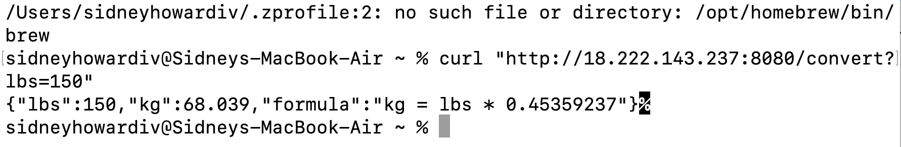
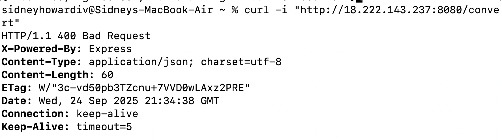
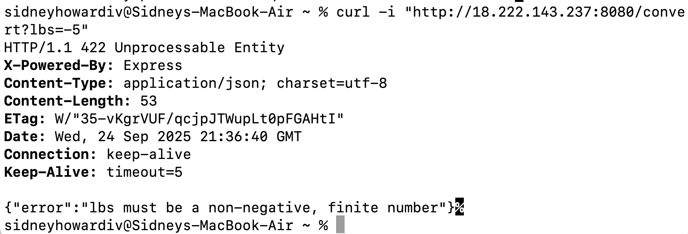
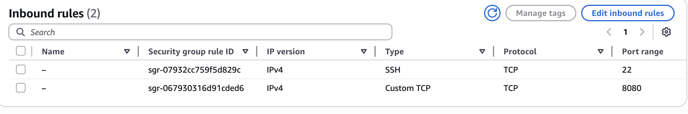

# lbs-to-kg-converter
Project 1 CS 454

A simple Node.js web service that converts pounds (lbs) to kilograms (kg).  
Accepts a `lbs` query parameter and returns JSON with the conversion result.

---

## Install dependencies
npm install

## Start the server
node server.js

## Test with curl
curl http://18.222.143.237:8080/convert?lbs=150

---

## Test Cases

## Test Cases

### Successful conversion
curl http://18.222.143.237:8080/convert?lbs=150
→ {"lbs":150,"kg":68.039,"formula":"kg = lbs * 0.45359237"}

---

### 400 Error – Missing Query Parameter
curl http://18.222.143.237:8080/convert
→ {"error":"Query param lbs is required and must be a number"}

---

### 422 Error – Negative Input
curl http://18.222.143.237:8080/convert?lbs=-5
→ {"error":"lbs must be a non-negative, finite number"}

---

### Security group

**Public Endpoint:**  
http://18.222.143.237:8080

**Security Group Summary:**

Protocol | Port | Source    | Purpose
---------|------|-----------|---------------------------
TCP      | 22   | My IP     | SSH access (login)
TCP      | 8080 | 0.0.0.0/0 | REST API testing (Node.js)
